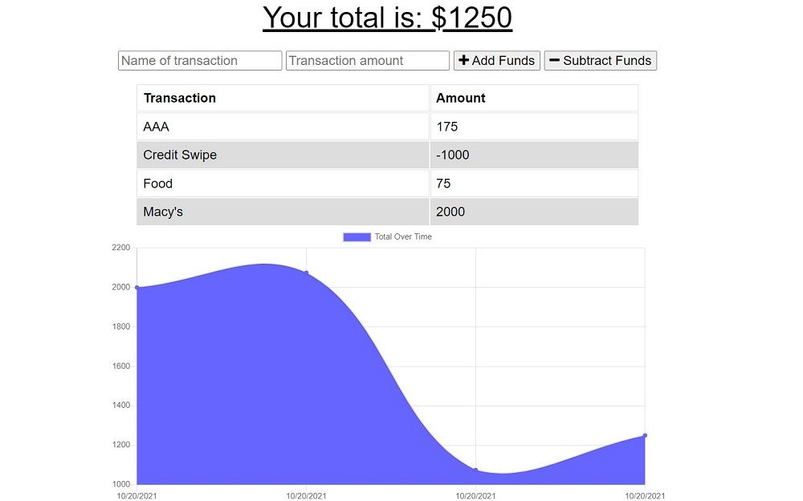

# offline-budget-tracker

   

## Description
Added functionality to an existing Budget Tracker application to allow for offline access and functionality.

## Table Of Contents
* [Links](#links)

* [Installation](#installation)

* [Instructions](#instructions)

* [Usage](#usage)

* [Screenshots](#screenshots)

* [License](#license)

## Links
[Git Repo](https://github.com/asantercureton/offline-budget-tracker)

[Heroku Link](https://asante-cureton-budget-tracker.herokuapp.com/)

## Installation
Run npm install at root directory.

## Instructions
Run npm start to intiate the budget tracker application.

## Usage
The user will be able to add expenses and deposits to their budget with or without a connection. When entering transactions offline, they should populate the total when brought back online.

## Screenshots
Below is a screenshot of the project:

## License

---
© 2021 PWA Budget Tracker.